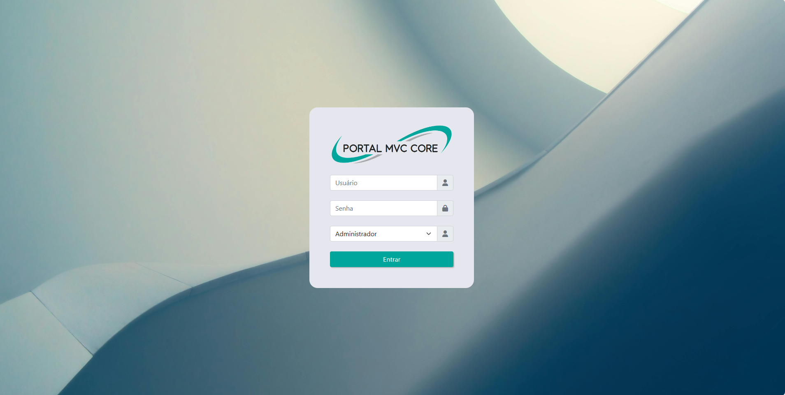
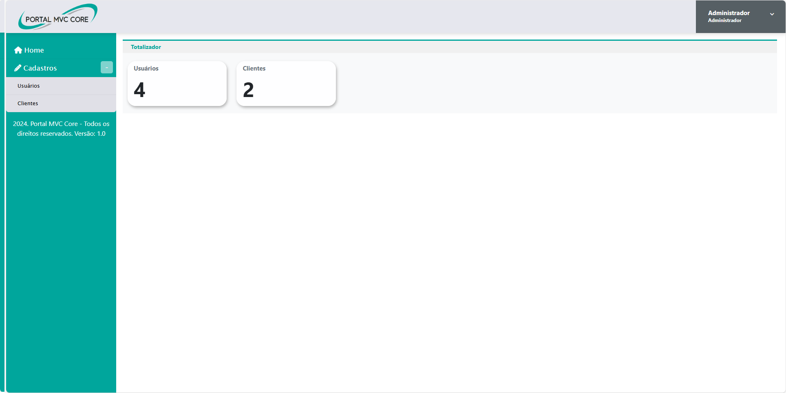
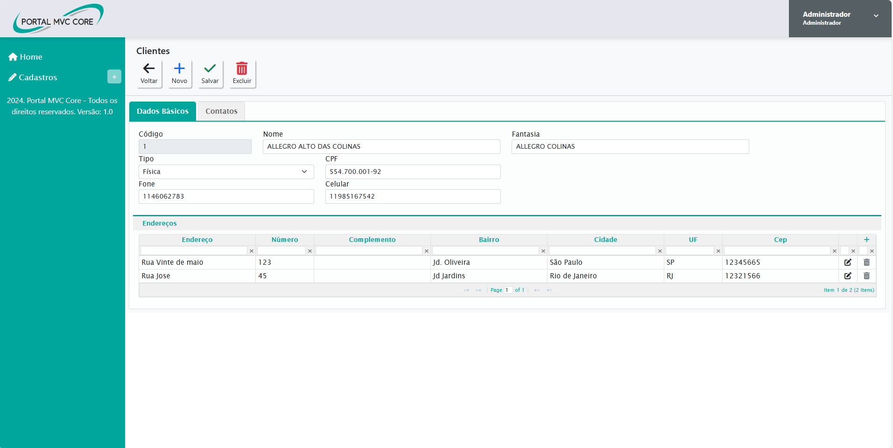
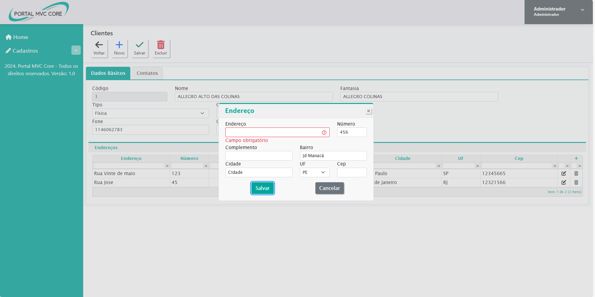

# PortalMVCCore

## Descrição
Este é um projeto de estudo para demonstrar a criação de uma aplicação web utilizando ASP.NET MVC Core. O projeto inclui uma tela de login, interface responsiva utilizando Bootstrap, JQuery UI, JqGrid, e está organizado em camadas para separar a lógica de dados e a lógica web. A aplicação se conecta a um banco de dados SQL Server utilizando um repositório.

## Funcionalidades
- Tela de Login
- Telas de cadastros
- Interface Responsiva com Bootstrap
- Interatividade com JQuery UI
- Grids de dados com JqGrid
- Arquitetura em Camadas (Dados e Web)
- Conexão ao SQL Server

## Tecnologias Utilizadas
- ASP.NET Core MVC
- Bootstrap
- JQuery UI
- JqGrid
- SQL Server

## Estrutura do Projeto
- **Projeto.Web**: Contém a interface do usuário e a lógica de apresentação.
- **Projeto.Data**: Contém a lógica de acesso a dados e os repositórios.

## Configuração e Execução
1. **Clone o Repositório**:
   ```
   git clone https://github.com/LipCam/PortalMVCCore.git
   cd projeto-estudo-aspnet-core
2. **Configurar a Conexão com o Banco de Dados**:  
No arquivo appsettings.json, configure a string de conexão com o seu banco de dados SQL Server:  
    ```json
    {
      "ConnectionStrings": {
        "DefaultConnection": "Server=.;Database=NomeDoBancoDeDados;Trusted_Connection=True;"
      }
    }
    ```
3. **Executar o Projeto**:
    ```
    dotnet run
    ```
## Uso
- Acesse http://localhost:5124 no navegador.
- Faça login com as credenciais configuradas no banco de dados.
- Navegue pela interface para testar as funcionalidades de login, os cadastros, UI responsiva, e interatividade com JqGrid.

## Imagens do Projeto

|  |  |
|:-------------------------------------:|:-------------------------------------:|
|  |  |

